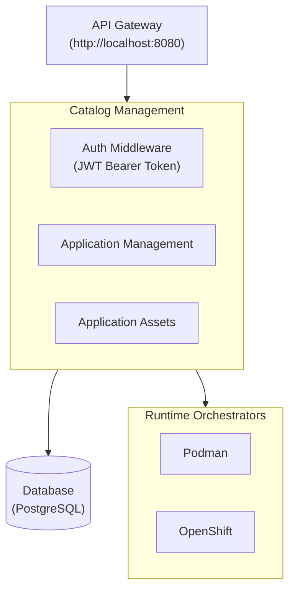

# Application Deployment API Proposal

**Version:** 1.0
**Date:** April 17, 2026
**Status:** Draft

## Table of Contents

1. [Executive Summary](#1-executive-summary)
2. [Background and Motivation](#2-background-and-motivation)
   - 2.1 [Current State](#21-current-state)
   - 2.2 [Problem Statement](#22-problem-statement)
   - 2.3 [Goals](#23-goals)
3. [Architecture Overview](#3-architecture-overview)
   - 3.1 [Key Concepts](#31-key-concepts)
   - 3.2 [System Components](#32-system-components)
4. [API Specification](#4-api-specification)
   - 4.1 [Base URL](#41-base-url)
   - 4.2 [Authentication](#42-authentication)
   - 4.3 [Endpoint Categories](#43-endpoint-categories)
5. [API Endpoint Details](#5-api-endpoint-details)
   - 5.1 [Authentication Endpoints](#51-authentication-endpoints)
     - 5.1.1 [Login](#511-login)
     - 5.1.2 [Refresh Token](#512-refresh-token)
     - 5.1.3 [Logout](#513-logout)
     - 5.1.4 [Get Current User](#514-get-current-user)
   - 5.2 [Application Management Endpoints](#52-application-management-endpoints)
     - 5.2.1 [List Applications](#521-list-applications)
     - 5.2.2 [Get Application Details](#522-get-application-details)
     - 5.2.3 [Create Application](#523-create-application)
     - 5.2.4 [Update Application](#524-update-application)
     - 5.2.5 [Delete Application](#525-delete-application)
     - 5.2.6 [Get Pod/Container Health Status](#526-get-podcontainer-health-status)
   - 5.3 [Catalog Endpoints](#53-catalog-endpoints)
     - 5.3.1 [List Available Architectures](#531-list-available-architectures)
     - 5.3.2 [Get Architecture Details](#532-get-architecture-details)
     - 5.3.3 [List Available Services](#533-list-available-services)
     - 5.3.4 [Get Service Details](#534-get-service-details)
  - 5.4 [Deploy Options Endpoints](#54-deploy-options-endpoints)
     - 5.4.1 [Get Architecture Deploy Options](#541-get-architecture-deploy-options)
     - 5.4.2 [Get Service Deploy Options](#542-get-service-deploy-options)
     - 5.4.3 [Get Component Provider Parameters](#543-get-component-provider-parameters)
6. [Error Handling](#6-error-handling)
   - 6.1 [Error Response Format](#61-error-response-format)
   - 6.2 [HTTP Status Codes](#62-http-status-codes)

## 1. Executive Summary

This proposal outlines the design and implementation of a comprehensive REST API for managing application deployments in the AI Services Catalog. The API will enable users to deploy, monitor, and manage AI service applications through a unified interface, supporting both individual services and complete architectures across multiple runtime environments (Podman and OpenShift).

## 2. Background and Motivation

### 2.1 Current State

The AI Services Catalog currently provides various AI services (chat, summarization, digitization) that can be deployed independently. However, there is no unified API for managing these deployments programmatically.

### 2.2 Problem Statement

Users need a standardized way to:

- Deploy services individually or as complete architectures
- Monitor deployment status and health
- Manage service configurations
- Access service endpoints
- Handle authentication and authorization

### 2.3 Goals

1. Provide a RESTful API for application lifecycle management
2. Support both architecture-level (multiple services) and service-level deployments
3. Enable multi-runtime support (Podman and OpenShift)
4. Implement secure authentication and authorization

## 3. Architecture Overview

### 3.1 Key Concepts

**Architecture**: A collection of multiple services that work together as a cohesive application (e.g., Digital Assistant).

**Service**: An individual AI service that can be deployed standalone (e.g., summarization service, chat service).

**Runtime**: The deployment environment (Podman, OpenShift).

### 3.2 Backend System Components



## 4. API Specification

### 4.1 Base URL

```
http://localhost:8080/api/v1
```

### 4.2 Authentication

All endpoints (except `/auth/*`) require JWT Bearer token authentication:

```
Authorization: Bearer <access_token>
```

**Token Lifecycle:**

- Access tokens expire after 15 minutes
- Refresh tokens valid for 7 days
- Token blacklisting on logout

### 4.3 Endpoint Categories

#### Authentication Endpoints

- `POST /api/v1/auth/login` - User login
- `POST /api/v1/auth/refresh` - Refresh access token
- `POST /api/v1/auth/logout` - User logout
- `GET /api/v1/auth/me` - Get current user info

#### Application Management Endpoints

- `GET /api/v1/applications` - List all deployments
- `GET /api/v1/applications/{id}` - Get deployment details
- `POST /api/v1/applications` - Create new deployment
- `PUT /api/v1/applications/{id}` - Update deployment
- `DELETE /api/v1/applications/{id}` - Delete deployment
- `GET /api/v1/applications/{id}/ps` - Get pod/container health status

#### Catalog Endpoints

- `GET /api/v1/architectures` - List available architectures
- `GET /api/v1/architectures/{id}` - Get architecture details

- `GET /api/v1/services` - List available services
- `GET /api/v1/services/{id}` - Get service details
- `GET /api/v1/services/{id}/params` - Get service custom params

## 5. API Endpoint Details

This section provides detailed specifications for each API endpoint, including request/response schemas and implementation notes.

### 5.1 Authentication Endpoints

#### 5.1.1 Login

**Endpoint:** `POST /api/v1/auth/login`

**Description:** Authenticates a user and returns JWT tokens for subsequent API calls.

**Request Headers:**

```
Content-Type: application/json
```

**Request Body:**

```json
{
  "username": "admin",
  "password": "password"
}
```

**Request Schema:**
| Field | Type | Required | Description |
|-------|------|----------|-------------|
| username | string | Yes | User's username |
| password | string | Yes | User's password |

**Response (200 OK):**

```json
{
  "access_token": "eyJhbGc...",
  "refresh_token": "eyJhbGc...",
  "token_type": "Bearer",
  "expires_in": 900
}
```

**Response Schema:**
| Field | Type | Description |
|-------|------|-------------|
| access_token | string | JWT access token for API authentication |
| refresh_token | string | JWT refresh token for obtaining new access tokens |
| token_type | string | Token type (always "Bearer") |
| expires_in | integer | Access token expiration time in seconds (900 = 15 minutes) |

**Error Responses:**

- `401 Unauthorized` - Invalid credentials
- `400 Bad Request` - Missing or invalid request body

**Implementation Notes:**

1. **Request Validation**: Use Gin's `ShouldBindJSON` to validate request body against `loginReq` struct (username, password required)
2. **User Lookup**: Call `UserRepository.GetByUserName(ctx, username)` to retrieve user from in-memory store
3. **Password Verification**: Use PBKDF2 with SHA256 to verify password against stored hash
   - Hash format: `iterations.salt.hash` (base64 encoded)
   - Uses constant-time comparison (`subtle.ConstantTimeCompare`) to prevent timing attacks
4. **Token Generation**:
   - Generate JWT access token with `TokenManager.GenerateAccessToken(userID)`
   - Generate JWT refresh token with `TokenManager.GenerateRefreshToken(userID)`
   - Both tokens include custom claims: `uid` (user ID), issuer ("ai-services-catalog-server"), subject, audience, expiry
   - Access token audience: "access", Refresh token audience: "refresh"
   - Signing method: HS256 with secret key
5. **Response**: Return both tokens with "Bearer" token type (handler returns access_token, refresh_token, token_type)
6. **Error Handling**: Return 401 for invalid credentials, 400 for malformed requests, 500 for database errors

**Security Considerations:**

- Passwords stored as PBKDF2 hashes (iterations + salt + hash, not plaintext)
- JWT tokens signed with HS256 and secret key
- Token audience field prevents token type confusion attacks
- Constant-time password comparison prevents timing attacks
- Access tokens expire after configured TTL (default: 15 minutes)
- Refresh tokens valid for configured TTL (default: 7 days)

---

#### 5.1.2 Refresh Token

**Endpoint:** `POST /api/v1/auth/refresh`

**Description:** Obtains a new access token using a valid refresh token.

**Request Headers:**

```
Content-Type: application/json
```

**Request Body:**

```json
{
  "refresh_token": "eyJhbGc..."
}
```

**Request Schema:**
| Field | Type | Required | Description |
|-------|------|----------|-------------|
| refresh_token | string | Yes | Valid refresh token from login |

**Response (200 OK):**

```json
{
  "access_token": "eyJhbGc...",
  "refresh_token": "eyJhbGc...",
  "token_type": "Bearer",
  "expires_in": 900
}
```

**Response Schema:**
| Field | Type | Description |
|-------|------|-------------|
| access_token | string | New JWT access token |
| refresh_token | string | New JWT refresh token |
| token_type | string | Token type (always "Bearer") |
| expires_in | integer | Access token expiration time in seconds |

**Error Responses:**

- `401 Unauthorized` - Invalid or expired refresh token
- `400 Bad Request` - Missing refresh token

**Implementation Notes:**

1. **Request Validation**: Use Gin's `ShouldBindJSON` to validate request body against `refreshReq` struct (refresh_token required)
2. **Verify Refresh Token Signature**: Call `TokenManager.ValidateRefreshToken(refreshToken)` to:
   - Parse JWT token with HS256 signature verification
   - Validate token expiry and claims
   - Check audience field is "refresh" (prevents access token misuse)
   - Extract user ID and expiry time from custom claims
   - Return 401 if signature is invalid or token is expired
3. **Check Token Blacklist**: Hash the refresh token and verify it's NOT blacklisted:
   - Call `TokenStore.Contains(HashToken(refreshToken), "refresh")`
   - Return 401 "token has been revoked" if found in blacklist
4. **Token Rotation**: Generate new token pair:
   - New access token with `TokenManager.GenerateAccessToken(userID)`
   - New refresh token with `TokenManager.GenerateRefreshToken(userID)`
   - Both tokens have fresh expiry times
5. **Blacklist Old Refresh Token**: Add the old refresh token to blacklist:
   - Hash the old refresh token: `oldTokenHash := HashToken(refreshToken)`
   - Call `TokenStore.Add(oldTokenHash, "refresh", refreshTokenExpiry)`
   - Inserts into `tokens_blacklist` table with token_type='refresh'
6. **Response**: Return new access_token, refresh_token, and token_type
7. **Error Handling**: Return 401 for invalid/expired/revoked tokens, 400 for missing or invalid request body, 500 for database errors

**Security Considerations:**

- Refresh tokens are rotated on each use (new tokens generated)
- Old refresh token is blacklisted after successful refresh to prevent reuse
- Token audience validation prevents token type confusion
- Both access and refresh tokens are blacklisted in the same `tokens_blacklist` table with `token_type` field

---

#### 5.1.3 Logout

**Endpoint:** `POST /api/v1/auth/logout`

**Description:** Invalidates the current access token and deletes the specified refresh token.

**Request Headers:**

```
Authorization: Bearer <access_token>
X-Refresh-Token: <refresh_token>
```

**Request Body:** None

**Response (200 OK):**

```json
{
  "message": "Successfully logged out"
}
```

**Response Schema:**
| Field | Type | Description |
|-------|------|-------------|
| message | string | Success message |

**Error Responses:**

- `400 Bad Request` - Missing refresh token in X-Refresh-Token header
- `401 Unauthorized` - Invalid or missing access token

**Implementation Notes:**

1. **Access Token Extraction**: Retrieve raw access token from Gin context using `middleware.CtxRawTokenKey`
   - Token was previously extracted and validated by `AuthMiddleware`
2. **Refresh Token Extraction**: Retrieve refresh token from `X-Refresh-Token` header
   - Return 400 if header is missing
3. **Access Token Validation**: Call `TokenManager.ValidateAccessToken(accessToken)` to:
   - Parse token and extract expiry time
   - If token is already invalid, treat as success (idempotent operation)
4. **Blacklist Access Token**: Hash and store access token in database:
   - Call `TokenStore.Add(HashToken(accessToken), "access", accessTokenExpiry)`
   - Inserts into `tokens_blacklist` table with token_type='access'
   - Use ON CONFLICT DO NOTHING to handle duplicate logout attempts
5. **Blacklist Refresh Token**: Hash and store refresh token in database:
   - Call `TokenStore.Add(HashToken(refreshToken), "refresh", refreshTokenExpiry)`
   - Inserts into `tokens_blacklist` table with token_type='refresh'
   - Use ON CONFLICT DO NOTHING to handle duplicate logout attempts
6. **Response**: Return success message "logged out"
7. **Error Handling**: Return 400 for missing refresh token header, 500 for database failures

**Token Storage Implementation:**

- Uses PostgreSQL `tokens_blacklist` table with columns: id, token_hash, token_type, expires_at
- Tokens are hashed using SHA-256 before storage (64-character hex string)
- Blacklist approach for both token types:
  - Access tokens: Blacklisted on logout (token_type='access')
  - Refresh tokens: Blacklisted on logout or refresh (token_type='refresh')
- Token type is stored as PostgreSQL ENUM with values: 'access', 'refresh'
- Periodic cleanup job removes expired tokens: `DELETE FROM tokens_blacklist WHERE expires_at < NOW()`
- Database-backed implementation supports multi-instance deployments
- Replaces the in-memory `InMemoryTokenBlacklist` for production use
- Server does NOT store plaintext tokens - only SHA-256 hashes

**Middleware Integration:**

- `AuthMiddleware` checks access token against blacklist:
  - Hash the token: `tokenHash := HashToken(accessToken)`
  - Query: `SELECT EXISTS(SELECT 1 FROM tokens_blacklist WHERE token_hash = $1 AND token_type = 'access' AND expires_at > NOW())`
  - Returns 401 "token revoked" if blacklisted
- `RefreshTokens` endpoint checks refresh token against blacklist:
  - Hash the token: `tokenHash := HashToken(refreshToken)`
  - Query: `SELECT EXISTS(SELECT 1 FROM tokens_blacklist WHERE token_hash = $1 AND token_type = 'refresh' AND expires_at > NOW())`
  - Returns 401 "token has been revoked" if blacklisted
- Ensures revoked tokens cannot be used even if still valid

**Token Hashing:**

Tokens use SHA-256 for hashing (not PBKDF2 like passwords) because:
- JWTs are already cryptographically secure and signed
- We only need fast lookup, not brute-force protection

```go
import (
    "crypto/sha256"
    "encoding/hex"
)

func HashToken(token string) string {
    hash := sha256.Sum256([]byte(token))
    return hex.EncodeToString(hash[:])
}
```

**Note**: Passwords use PBKDF2 with SHA-256 (slow, with salt and iterations) for brute-force protection, while tokens use simple SHA-256 (fast) for lookup since JWTs are already secure.

---

#### 5.1.4 Get Current User

**Endpoint:** `GET /api/v1/auth/me`

**Description:** Returns information about the currently authenticated user.

**Request Headers:**

```
Authorization: Bearer <access_token>
```

**Request Body:** None

**Response (200 OK):**

```json
{
  "id": "uid_1",
  "username": "admin",
  "name": "Administrator"
}
```

**Response Schema:**
| Field | Type | Description |
|-------|------|-------------|
| id | string | Unique user identifier |
| username | string | User's username |
| name | string | User's display name |

**Error Responses:**

- `401 Unauthorized` - Invalid or missing access token

**Implementation Notes:**

1. **User ID Extraction**: Retrieve user ID from Gin context using `middleware.CtxUserIDKey`
   - User ID was extracted from JWT token by `AuthMiddleware` during authentication
2. **User Lookup**: Call `AuthService.GetUser(ctx, userID)` which:
   - Calls `UserRepository.GetByID(ctx, userID)` to fetch user from in-memory store
   - Returns `models.User` struct with ID, UserName, PasswordHash, Name
3. **Response Filtering**: Return only safe fields (id, username, name)
   - **Do not expose**: PasswordHash or other sensitive information
4. **Error Handling**: Return 401 for missing user ID, 404 for user not found

**Middleware Flow:**

- `AuthMiddleware` validates Bearer token from Authorization header
- Extracts user ID from JWT custom claims (`uid` field)
- Sets user ID in Gin context with key `middleware.CtxUserIDKey`
- Sets raw token in context with key `middleware.CtxRawTokenKey`
- Adds `X-Token-Exp` header with token expiry time (UTC format)

**Repository:**

- Uses `InMemoryUserRepo` with dual-index maps (by ID and by username)
- Thread-safe with RWMutex for concurrent access
- Returns `ErrUserNotFound` if user doesn't exist

---

### 5.2 Application Management Endpoints

#### 5.2.1 List Applications

**Endpoint:** `GET /api/v1/applications`

**Description:** Retrieves a paginated list of all applications for the authenticated user.

**Request Headers:**

```
Authorization: Bearer <access_token>
```

**Query Parameters:**
| Parameter | Type | Required | Default | Description |
|-----------|------|----------|---------|-------------|
| page | integer | No | 1 | Page number (1-indexed) |
| page_size | integer | No | 20 | Number of items per page (max: 100) |

**Request Body:** None

**Response (200 OK):**

```json
{
  "data": [
    {
      "id": "123e4567-e89b-12d3-a456-426614174000",
      "name": "RAG Production",
      "deployment_type": "architecture",
      "type": "Digital Assistant",
      "status": "Running",
      "message": "All services are operational",
      "created_at": "2026-04-15T10:30:00Z",
      "updated_at": "2026-04-15T10:35:00Z"
    },
    {
      "id": "223e4567-e89b-12d3-a456-426614174001",
      "name": "Summarization Dev",
      "deployment_type": "service",
      "type": "Summary",
      "status": "Running",
      "message": "Service deployed successfully",
      "created_at": "2026-04-15T11:00:00Z",
      "updated_at": "2026-04-15T11:05:00Z"
    }
  ],
  "pagination": {
    "page": 1,
    "page_size": 20,
    "total_items": 2,
    "total_pages": 1,
    "has_next": false,
    "has_prev": false
  }
}
```

**Response Schema:**

**Root Object:**
| Field | Type | Description |
|-------|------|-------------|
| data | array | Array of application objects |
| pagination | object | Pagination metadata |

**Application Object (data[]):**
| Field | Type | Description |
|-------|------|-------------|
| id | string | Application ID (UUID) |
| name | string | Application name |
| deployment_type | string | Type of deployment: "architecture" or "service" |
| type | string | Application type: "Digital Assistant" for architectures, "Summary" for summarization services |
| status | string | Current status: "Downloading", "Deploying", "Running", "Deleting", "Error" |
| message | string | Status message or error details |
| created_at | string | ISO 8601 timestamp of creation |
| updated_at | string | ISO 8601 timestamp of last update |

**Pagination Object:**
| Field | Type | Description |
|-------|------|-------------|
| page | integer | Current page number (1-indexed) |
| page_size | integer | Number of items per page |
| total_items | integer | Total number of applications matching filters |
| total_pages | integer | Total number of pages |
| has_next | boolean | Whether there is a next page |
| has_prev | boolean | Whether there is a previous page |

**Error Responses:**

- `400 Bad Request` - Invalid query parameters (e.g., page < 1, page_size > 100)
- `401 Unauthorized` - Invalid or missing access token
- `500 Internal Server Error` - Server error

**Implementation Notes:**

1. Validate JWT token from Authorization header via `AuthMiddleware`
2. Validate pagination parameters (page >= 1, page_size between 1-100)
3. Query all rows from the applications table with pagination support
4. For each application, use the template field to fetch the corresponding type (Digital Assistant) and deployment_type (architecture or service) from the architecure or service metadata file for the corresponding template id (This will be unique and belongs to either architecture or service).
5. Construct paginated response with application data and metadata

**Example Requests:**

```
# Get first page with default settings
GET /api/v1/applications

# Get second page with 50 items per page
GET /api/v1/applications?page=2&page_size=50
```

---

#### 5.2.2 Get Application Details

**Endpoint:** `GET /api/v1/applications/{id}`

**Description:** Retrieves detailed information about a specific application.

**Request Headers:**

```
Authorization: Bearer <access_token>
```

**Path Parameters:**
| Parameter | Type | Required | Description |
|-----------|------|----------|-------------|
| id | string | Yes | Application ID |

**Request Body:** None

**Response (200 OK) - Deployable Architecture:**

```json
{
  "id": "123e4567-e89b-12d3-a456-426614174000",
  "name": "RAG Production",
  "deployment_type": "architecture",
  "type": "Digital Assistant",
  "status": "Running",
  "message": "All services are operational",
  "created_at": "2026-04-15T10:30:00Z",
  "updated_at": "2026-04-15T10:35:00Z",
  "services": [
    {
      "id": "chat",
      "type": "QA-Chatbot",
      "endpoints": [
        {
          "name": "ui",
          "url": "https://rag-production-chat-ui.apps.cluster.example.com"
        },
        {
          "name": "backend",
          "url": "https://rag-production-chat-api.apps.cluster.example.com"
        }
      ],
      "version": "1.0.0",
      "components": [
        {
          "type": "vector_db",
          "provider": "opensearch"
        },
        {
          "type": "llm",
          "provider": "vllm",
          "metadata": {
            "model": "ibm-granite/granite-3.3-8b-instruct"
          }
        },
        {
          "type": "embedding",
          "provider": "vllm",
          "metadata": {
            "model": "BAAI/bge-base-en-v1.5"
          }
        }
      ],
      "created_at": "2026-04-15T10:31:00Z",
      "updated_at": "2026-04-15T10:35:00Z"
    },
    {
      "id": "summarize",
      "type": "Summary",
      "endpoints": [
        {
          "name": "backend",
          "url": "https://rag-production-summarization-api.apps.cluster.example.com"
        }
      ],
      "version": "1.0.0",
      "components": [
        {
          "type": "vector_db",
          "provider": "opensearch"
        },
        {
          "type": "llm",
          "provider": "watsonx",
          "metadata": {
            "model": "ibm/granite-13b-chat-v2",
            "project_id": "wx-project-123"
          }
        }
      ],
      "created_at": "2026-04-15T10:32:00Z",
      "updated_at": "2026-04-15T10:35:00Z"
    }
  ]
}
```

**Response (200 OK) - Services Deployment:**

```json
{
  "id": "223e4567-e89b-12d3-a456-426614174001",
  "name": "Summarization Dev",
  "deployment_type": "service",
  "type": "Summary",
  "status": "Running",
  "message": "Service deployed successfully",
  "created_at": "2026-04-15T11:00:00Z",
  "updated_at": "2026-04-15T11:05:00Z",
  "services": [
    {
      "id": "summarize",
      "type": "Summary",
      "endpoints": [
        {
          "name": "backend",
          "url": "http://localhost:8081"
        }
      ],
      "version": "1.0.0",
      "components": [
        {
          "type": "vector_db",
          "provider": "opensearch"
        },
        {
          "type": "llm",
          "provider": "vllm",
          "metadata": {
            "model": "ibm-granite/granite-3.3-8b-instruct"
          }
        }
      ],
      "created_at": "2026-04-15T11:00:00Z",
      "updated_at": "2026-04-15T11:05:00Z"
    }
  ]
}
```

**Response Schema:**

**Application Level:**
| Field | Type | Description |
|-------|------|-------------|
| id | string | Application ID (UUID) |
| name | string | Application name |
| deployment_type | string | "architecture" or "service" |
| type | string | Application type: "Digital Assistant" for architectures, "Summary" for summarization services |
| status | string | Current status (Downloading, Deploying, Running, Deleting, Error) |
| message | string | Status message or error details |
| created_at | string | Creation timestamp |
| updated_at | string | Last update timestamp |
| services | array | Array of service objects |

**Service Object:**
| Field | Type | Description |
|-------|------|-------------|
| id | string | Service identifier (e.g., "chat", "summarize", "digitize") |
| type | string | Service type (e.g., "QA-Chatbot", "Summary", "Digitization") |
| endpoints | array | Array of endpoint objects |
| version | string | Service version |
| components | array | Array of component objects used by this service |
| created_at | string | Creation timestamp |
| updated_at | string | Last update timestamp |

**Endpoint Object:**
| Field | Type | Description |
|-------|------|-------------|
| name | string | Endpoint name: "ui", "backend", or "api". This will be the container name for each service in Podman |
| url | string | Full endpoint URL |

**Component Object:**
| Field | Type | Description |
|-------|------|-------------|
| type | string | Component type (e.g., "vector_db", "llm", "embedding", "reranker") |
| provider | string | Provider/implementation (e.g., "opensearch", "vllm", "watsonx") |
| metadata | object | Optional component-specific configuration and metadata (e.g., model, project_id). Only included when relevant for the component type. |

**Error Responses:**

- `401 Unauthorized` - Invalid or missing access token
- `404 Not Found` - Application not found
- `403 Forbidden` - User doesn't have access to this application
- `500 Internal Server Error` - Server error

**Implementation Notes:**

1. Validate the incoming JWT token from Authorization header
2. Execute database query on applications table using `id` as the filter
3. Perform JOIN with services table to fetch associated services
4. For each service, perform JOIN with service_dependencies table to fetch component dependencies
5. For each component dependency, fetch component details from components table including metadata (excluding endpoints)
6. For each application, use the template field to fetch the corresponding type (Digital Assistant) and deployment_type (architecture or service) from the architecture or service metadata file for the corresponding template id (This will be unique and belongs to either architecture or service)
7. Map service IDs to their service identifiers (e.g., "chat", "summarize", "digitize") from the service metadata
8. Return the mapped response with appropriate HTTP status code including nested components within each service

---

#### 5.2.3 Create Application

**Endpoint:** `POST /api/v1/applications`

**Description:** Creates a new application (architecture or service) with optional custom parameters.

**Request Headers:**

```
Authorization: Bearer <access_token>
Content-Type: application/json
```

**Request Body Example 1 (Architecture):**

```json
{
  "name": "Production RAG System",
  "architecture": "rag",
  "services": [
    {
      "type": "service",
      "service_id": "digitize",
      "enabled": true,
      "version": "1.0.0",
      "components": [
        {
          "type": "component",
          "component_type": "vector_db",
          "provider_id": "opensearch"
        },
        {
          "type": "component",
          "component_type": "llm",
          "provider_id": "vllm",
          "params": {
            "model": "ibm-granite/granite-3.3-8b-instruct"
          }
        },
        {
          "type": "component",
          "component_type": "embedding",
          "provider_id": "vllm",
          "params": {
            "model": "ibm-granite/granite-embedding-278m-multilingual"
          }
        }
      ]
    },
    {
      "type": "service",
      "service_id": "chat",
      "enabled": true,
      "version": "1.0.0",
      "components": [
        {
          "type": "component",
          "component_type": "vector_db",
          "provider_id": "opensearch"
        },
        {
          "type": "component",
          "component_type": "llm",
          "provider_id": "watsonx",
          "params": {
            "model": "ibm/granite-13b-chat-v2",
            "apiKey": "ibm-cloud-api-key-456",
            "projectId": "wx-project-123",
            "endpoint": "https://us-south.ml.cloud.ibm.com"
          }
        },
        {
          "type": "component",
          "component_type": "embedding",
          "provider_id": "vllm",
          "params": {
            "model": "ibm-granite/granite-embedding-278m-multilingual"
          }
        }
      ]
    }
  ]
}
```

**Request Schema:**
| Field | Type | Required | Description |
|-------|------|----------|-------------|
| name | string | Yes | Application name (3-100 chars) |
| architecture | string | Yes | Architecture ID (e.g., rag) |
| services | array | Yes | Array of service objects to deploy with their component selections |

**Service Object (in services array):**
| Field | Type | Required | Description |
|-------|------|----------|-------------|
| type | string | Yes | Must be "service" |
| service_id | string | Yes | Service identifier (e.g., "digitize", "chat", "summarize") |
| enabled | boolean | Yes | Whether the service is enabled |
| version | string | No | Service version to deploy. If not specified, uses the latest compatible version |
| components | array | Yes | Array of component selections for this service |

**Component Object (in components array):**
| Field | Type | Required | Description |
|-------|------|----------|-------------|
| type | string | Yes | Must be "component" |
| component_type | string | Yes | Component type (e.g., "vector_db", "llm", "embedding", "reranker") |
| provider_id | string | Yes | Provider identifier (e.g., "opensearch", "vllm", "watsonx") |
| instance_id | string | Conditional | Required when reusing an existing component instance |
| params | object | Conditional | Required when creating a new component (not reusing). Contains provider-specific configuration |

**Component Selection Logic:**

Each component can be specified in one of two ways:

1. **Reuse Existing Component** - When `instance_id` field is present:
   - The backend will use an existing, already-deployed component instance
   - Required fields: `type`, `component_type`, `instance_id`, `provider_id`
   - Example: `{ "type": "component", "component_type": "vector_db", "instance_id": "opensearch-instance-1", "provider_id": "opensearch" }`

2. **Create New Component** - When `instance_id` field is absent:
   - The backend will create and deploy a new component instance
   - Required fields: `type`, `component_type`, `provider_id`, `params`
   - Example: `{ "type": "component", "component_type": "vector_db", "provider_id": "opensearch", "params": { "memoryLimit": "8Gi", "auth": {...} } }`

**Response (202 Accepted):**

```json
{
  "id": "123e4567-e89b-12d3-a456-426614174000",
  "status": "Downloading",
  "message": "Deployment initiated successfully"
}
```

**Response Schema:**
| Field | Type | Description |
|-------|------|-------------|
| id | string | Auto-generated application ID (UUID) |
| status | string | Initial status ("Downloading") |
| message | string | Status message |

**Error Responses:**

- `400 Bad Request` - Invalid request body or validation errors
- `401 Unauthorized` - Invalid or missing access token
- `409 Conflict` - Application name already exists (normalized deployment_name conflicts)
- `422 Unprocessable Entity` - Parameter validation failed or invalid template
- `500 Internal Server Error` - Server error

**Implementation Notes:**

1. **Token Validation**: Validate JWT token from Authorization header

2. **ID Generation**:
   - Auto-generate `id` as UUID v4
   - Use standard UUID generation library (e.g., `github.com/google/uuid`)
   - No need to check uniqueness as UUIDs are globally unique

3. **Architecture Validation**:
   - Verify architecture exists in catalog
   - Retrieve architecture metadata and available services

4. **Services Validation**:
   - Validate each service in the services array
   - Verify `service_id` exists in the catalog and is compatible with the architecture
   - Check that service versions meet architecture requirements
   - Validate `enabled` flag is boolean
   - Return 422 error if any service validation fails

5. **Components Validation** (for each service):
   - Validate each component in the service's components array
   - Verify `component_type` is valid and required by the service
   - Verify `provider_id` exists for the given component type
   - For components with `instance_id`:
     - Verify the instance exists in the system
     - Verify the instance's provider matches the specified `provider_id`
     - Verify the instance is compatible with the service requirements
   - For components without `instance_id` (new components):
     - Validate `params` object against the provider's JSON Schema
     - Verify all required fields are present in params
     - Validate field values against schema constraints (type, pattern, min/max, etc.)
   - Validate component dependencies are satisfied
   - Return 422 error with details if validation fails

7. **Database Operations**:
   - Begin transaction
   - Insert record in applications table with:
     - Generated id (UUID, Primary Key)
     - name, template, created_by
     - params as JSONB
     - status = "Downloading"
   - Insert corresponding records in services table
   - Commit transaction

8. **Async Deployment**:
   - Initiate background deployment job with id
   - Return immediately with 202 Accepted
   - Background worker handles actual deployment

9. **Deployment Status Updates**:
   - On success: Update status to "Running" and populate endpoints in services table
   - On failure: Update status to "Error" with error message

---

#### 5.2.4 Update Application

**Endpoint:** `PUT /api/v1/applications/{id}`

**Description:** Updates the display name of an existing application.

**Request Headers:**

```
Authorization: Bearer <access_token>
Content-Type: application/json
```

**Path Parameters:**
| Parameter | Type | Required | Description |
|-----------|------|----------|-------------|
| id | string | Yes | Application ID |

**Request Body:**

```json
{
  "name": "RAG Production Updated"
}
```

**Request Schema:**
| Field | Type | Required | Description |
|-------|------|----------|-------------|
| name | string | Yes | Updated name (3-100 chars) |

**Response (200 OK):**

```json
{
  "id": "123e4567-e89b-12d3-a456-426614174000",
  "name": "RAG Production Updated",
  "deployment_type": "architecture",
  "type": "Digital Assistant",
  "status": "Running",
  "message": "Deployment name updated successfully",
  "updated_at": "2026-04-15T11:00:00Z"
}
```

**Response Schema:**
| Field | Type | Description |
|-------|------|-------------|
| id | string | Application ID (UUID, unchanged) |
| name | string | Updated name |
| deployment_type | string | Deployment type |
| type | string | Application type |
| status | string | Current status |
| message | string | Status message |
| updated_at | string | Update timestamp |

**Error Responses:**

- `400 Bad Request` - Invalid request body or name validation failed
- `401 Unauthorized` - Invalid or missing access token
- `403 Forbidden` - User doesn't own this application
- `404 Not Found` - Application not found
- `500 Internal Server Error` - Server error

**Implementation Notes:**

1. **Token Validation**: Validate JWT token from Authorization header
2. **Request Validation**: Validate deployment_name format and length (3-100 chars)
3. **Database Update**:
   - Execute UPDATE query on applications table to update name field
   - Use id as the filter (WHERE id = $1)
   - Update updated_at timestamp
4. **Response**: Fetch and return the complete updated application object

---

#### 5.2.5 Delete Application

**Endpoint:** `DELETE /api/v1/applications/{id}`

**Description:** Deletes an application and all associated resources.

**Request Headers:**

```
Authorization: Bearer <access_token>
```

**Path Parameters:**
| Parameter | Type | Required | Description |
|-----------|------|----------|-------------|
| id | string | Yes | Application ID |

**Query Parameters:**
| Parameter | Type | Required | Description |
|-----------|------|----------|-------------|
| skip-cleanup | boolean | No | If true, skips data cleanup (default: false) |

**Request Body:** None

**Response (202 Accepted):**

```json
{
  "id": "123e4567-e89b-12d3-a456-426614174000",
  "status": "deleting",
  "message": "Deletion initiated successfully"
}
```

**Response Schema:**
| Field | Type | Description |
|-------|------|-------------|
| id | string | Application ID (UUID) |
| status | string | Status (deleting) |
| message | string | Status message |

**Error Responses:**

- `401 Unauthorized` - Invalid or missing access token
- `403 Forbidden` - User doesn't own this application
- `404 Not Found` - Application not found
- `409 Conflict` - Application is already being deleted
- `500 Internal Server Error` - Server error

**Implementation Notes:**

- Update database status to "deleting"
- Initiate async deletion job
- Delete in order: services → infrastructure → namespace/pods
- Handle partial deletion failures gracefully
- If skip-cleanup=true, preserve application data (documents, embeddings, etc.)
- If skip-cleanup=false (default), clean up all application data
- Clean up database records after successful deletion
- For OpenShift: delete namespace and all resources
- For Podman: stop and remove all containers

---

#### 5.2.6 Get Pod/Container Health Status

**Endpoint:** `GET /api/v1/applications/{id}/ps`

**Description:** Retrieves health status of all pods/containers in the deployment.

**Request Headers:**

```
Authorization: Bearer <access_token>
```

**Path Parameters:**
| Parameter | Type | Required | Description |
|-----------|------|----------|-------------|
| id | string | Yes | Application ID |

**Request Body:** None

**Response (200 OK):**

```json
{
  "id": "123e4567-e89b-12d3-a456-426614174000",
  "pods": [
    {
      "pod_id": "a1b2c3d4e5f6",
      "pod_name": "rag-production-chat",
      "status": "Running (Ready)",
      "created": "2d5h",
      "exposed": [8080, 8081],
      "containers": [
        {
          "name": "chat-ui",
          "status": "Ready"
        },
        {
          "name": "nginx",
          "status": "Ready"
        }
      ]
    },
    {
      "pod_id": "c3d4e5f6g7h8",
      "pod_name": "rag-production-summarization-api",
      "status": "Running (NotReady)",
      "created": "2d5h",
      "exposed": "8083",
      "containers": [
        {
          "name": "summarization-api",
          "status": "starting"
        }
      ]
    }
  ]
}
```

**Response Schema:**
| Field | Type | Description |
|-------|------|-------------|
| id | string | Application ID (UUID) |
| pods | array | Array of pod objects |

**Pod Object Schema:**
| Field | Type | Description |
|-------|------|-------------|
| pod_id | string | Pod ID (first 12 characters) |
| pod_name | string | Pod name |
| status | string | Pod status with health indicator (e.g., "Running (Ready)", "Running (NotReady)") |
| created | string | Time since pod creation (e.g., "2d5h", "30m") |
| exposed | string | Comma-separated list of exposed ports or "none" |
| containers | array | Array of container objects within the pod |

**Container Object Schema:**
| Field | Type | Description |
|-------|------|-------------|
| name | string | Container name |
| status | string | Container status (Ready, running, starting, exited, etc.) |

**Error Responses:**

- `401 Unauthorized` - Invalid or missing access token
- `403 Forbidden` - User doesn't own this application
- `404 Not Found` - Application not found
- `500 Internal Server Error` - Server error
- `503 Service Unavailable` - Cannot connect to runtime

**Implementation Notes:**

- Use the same output format for both Podman and OpenShift runtimes
- Pod status includes health indicator: "Running (Ready)" when all containers are healthy, "Running (NotReady)" when some containers are unhealthy
- Container status shows health check results: "Ready" for healthy containers, actual status (starting, exited, etc.) for others
- Filter pods by application label: `ai-services.io/application=<id>`
- For OpenShift: query pods using Kubernetes API
- For Podman: use `podman pod ps` and `podman pod inspect`
- Cache results for 5-10 seconds to reduce API calls
- Handle cases where runtime is temporarily unavailable
- Return partial results if some pods are inaccessible

---

### 5.3 Catalog Endpoints

#### 5.3.1 List Available Deployable Architectures

**Endpoint:** `GET /api/v1/architectures`

**Description:** Retrieves a list of all available architecture templates.

**Request Headers:**

```
Authorization: Bearer <access_token>
```

**Request Body:** None

**Response (200 OK):**

```json
[
  {
    "id": "rag",
    "name": "Digital Assistant",
    "description": "Enable digital assistants using Retrieval-Augmented Generation (RAG), including AI services that query a managed knowledge base to answer questions from custom documents and data.",
    "version": "1.0.0",
    "certified_by": "IBM",
    "services": ["chat", "digitization", "summarization"]
  }
]
```

**Response Schema:**
| Field | Type | Description |
|-------|------|-------------|
| id | string | Architecture template ID |
| name | string | Architecture template name |
| description | string | Description of the architecture |
| version | string | Architecture version |
| type | string | Type (architecture) |
| certified_by | string | Certification authority |
| services | array | Array of service IDs included in this architecture |

**Error Responses:**

- `401 Unauthorized` - Invalid or missing access token
- `500 Internal Server Error` - Server error

**Implementation Notes:**

- Check out the proposal https://github.com/IBM/project-ai-services/pull/636
- Read architectures from `ai-services/assets/architectures/` directory
- Parse metadata.yaml files and convert to JSON response format
- Return all available architecture templates

---

#### 5.3.2 Get Architecture Details

**Endpoint:** `GET /api/v1/architectures/{id}`

**Description:** Retrieves detailed information about a specific architecture template.

**Request Headers:**

```
Authorization: Bearer <access_token>
```

**Path Parameters:**
| Parameter | Type | Required | Description |
|-----------|------|----------|-------------|
| id | string | Yes | Architecture template ID (e.g., "rag") |

**Request Body:** None

**Example Request:**

```
GET /api/v1/architectures/rag
```

**Response (200 OK):**

```json
{
  "id": "rag",
  "name": "Digital Assistant",
  "description": "Enable digital assistants using Retrieval-Augmented Generation (RAG), including AI services that query a managed knowledge base to answer questions from custom documents and data.",
  "version": "1.0.0",
  "type": "architecture",
  "certified_by": "IBM",
  "services": [
    {
      "id": "chat",
      "version": ">=1.0.0"
    },
    {
      "id": "digitization",
      "version": ">=1.0.0"
    },
    {
      "id": "summarization",
      "version": ">=1.0.0",
      "optional": true
    }
  ],
  "links": {
    "demo": "https://example.com/demo/rag",
    "code": "https://github.com/project-ai-services/spyre-rag",
    "documentation": "https://docs.example.com/rag"
  }
}
```

**Response Schema:**
| Field | Type | Description |
|-------|------|-------------|
| id | string | Architecture template ID |
| name | string | Architecture name |
| description | string | Detailed description |
| version | string | Architecture version |
| type | string | Type (architecture) |
| certified_by | string | Certification authority |
| services | array | Array of service objects |
| links | object | Related links (demo, code, documentation) |

**Service Object Schema:**
| Field | Type | Description |
|-------|------|-------------|
| id | string | Service ID |
| version | string | Version constraint |
| optional | boolean | Whether service is optional (only present if true) |

**Implementation Notes:**

- Check out the proposal https://github.com/IBM/project-ai-services/pull/636
- Read architecture metadata from `ai-services/assets/architectures/{id}/metadata.yaml`
- Parse YAML and convert to JSON response format

---

#### 5.3.3 List Available Deployable Services

**Endpoint:** `GET /api/v1/services`

**Description:** Retrieves a list of all deployable service templates. Dependency-only services are excluded from this list.

**Request Headers:**

```
Authorization: Bearer <access_token>
```

**Request Body:** None

**Response (200 OK):**

```json
[
  {
    "id": "chat",
    "name": "Question and Answer",
    "description": "Answer questions in natural language by sourcing general & domain-specific knowledge",
    "version": "1.0.0",
    "type": "service",
    "certified_by": "IBM"
  },
  {
    "id": "summarization",
    "name": "Summarization",
    "description": "Consolidates input text into a brief statement of main points",
    "version": "1.0.0",
    "type": "service",
    "certified_by": "IBM"
  },
  {
    "id": "digitization",
    "name": "Digitize Documents",
    "description": "Transforms documents such as manuals, invoices, and more into texts",
    "version": "1.0.0",
    "type": "service",
    "certified_by": "IBM"
  }
]
```

**Response Schema:**
| Field | Type | Description |
|-------|------|-------------|
| id | string | Service template ID |
| name | string | Service display name |
| description | string | Description of the service |
| version | string | Service version |
| type | string | Service type |
| certified_by | string | Certification authority |
| architectures | array | Array of architecture IDs that include this service |

**Error Responses:**

- `401 Unauthorized` - Invalid or missing access token
- `500 Internal Server Error` - Server error

**Implementation Notes:**

- Check out the proposal https://github.com/IBM/project-ai-services/pull/636
- Read services from `ai-services/assets/services/` directory
- Filter OUT services that have `dependency_only: true` in their metadata
- Only return deployable services (chat, summarization, digitization)
- Dependency-only services (opensearch, embedding, instruct, reranker) should NOT be included in the response

---

#### 5.3.4 Get Service Details

**Endpoint:** `GET /api/v1/services/{id}`

**Description:** Retrieves detailed information about a specific service template.

**Request Headers:**

```
Authorization: Bearer <access_token>
```

**Path Parameters:**
| Parameter | Type | Required | Description |
|-----------|------|----------|-------------|
| id | string | Yes | Service template ID (e.g., "summarize") |

**Request Body:** None

**Example Request:**

```
GET /api/v1/services/chat
```

**Response (200 OK):**

```json
{
  "id": "chat",
  "name": "Question and Answer",
  "description": "Answer questions in natural language by sourcing general & domain-specific knowledge",
  "version": "1.0.0",
  "type": "service",
  "certified_by": "IBM"
}
```

**Response Schema:**
| Field | Type | Description |
|-------|------|-------------|
| id | string | Service template ID |
| name | string | Service display name |
| description | string | Detailed description |
| version | string | Service version |
| type | string | Service type |
| certified_by | string | Certification authority |
| architectures | array | Architecture IDs that include this service |

**Implementation Notes:**

- Check out the proposal https://github.com/IBM/project-ai-services/pull/636
- Read service metadata from `ai-services/assets/services/{id}/metadata.yaml`
- Parse YAML and convert to JSON response format
- Include all fields from metadata.yaml in response

---

### 5.4 Deploy Options Endpoints

This section describes the endpoints for retrieving deployment options, component providers, and configuration parameters for dynamic component selection during application deployment.

#### 5.4.1 Get Architecture Deploy Options

**Endpoint:** `GET /api/v1/architectures/{id}/deploy-options`

**Description:** Retrieves available providers and dependency rules for all services and their components within an architecture. This endpoint returns providers (blueprints) for creating new components and dependency rules, but does NOT include running instances.

**Request Headers:**

```
Authorization: Bearer <access_token>
```

**Path Parameters:**
| Parameter | Type | Required | Description |
|-----------|------|----------|-------------|
| id | string | Yes | Architecture ID (e.g., "rag") |

**Request Body:** None

**Response (200 OK):**

```json
{
  "id": "rag",
  "name": "Digital Assistant",
  "global_components": [
    {
      "type": "vector_db",
      "name": "Vector store",
      "providers": [
        {
          "id": "opensearch",
          "name": "OpenSearch",
          "description": "Distributed search and analytics engine"
        }
      ]
    },
    {
      "type": "embedding",
      "name": "Embedding Model",
      "providers": [
        {
          "id": "vllm",
          "name": "vLLM Embeddings",
          "schema": "/api/v1/components/embedding/providers/vllm/params"
        }
      ]
    }
  ],
  "services": [
    {
      "type": "service",
      "id": "digitize",
      "name": "Digitize documents",
      "components": [
        {
          "type": "vector_db",
          "name": "Vector store",
          "providers": [
            {
              "id": "opensearch",
              "name": "OpenSearch",
              "description": "Distributed search and analytics engine"
            }
          ]
        },
        {
          "type": "llm",
          "name": "LLM Model",
          "providers": [
            {
              "id": "vllm",
              "name": "vLLM Instruct",
              "description": "Deploy new instruct model on vLLM",
              "schema": "/api/v1/components/llm/providers/vllm/params"
            },
            {
              "id": "watsonx",
              "name": "IBM watsonx.ai Instruct",
              "description": "Configure watsonx.ai for instruct models",
              "schema": "/api/v1/components/llm/providers/watsonx/params"
            }
          ]
        }
      ]
    }
  ]
}
```

**Response Schema:**

**Root Object:**
| Field | Type | Description |
|-------|------|-------------|
| id | string | Architecture identifier |
| name | string | Architecture display name |
| global_components | array | Array of global component objects shared across services |
| services | array | Array of service objects with their specific components |

**Global Component Object:**
| Field | Type | Description |
|-------|------|-------------|
| type | string | Component type (e.g., "vector_db", "embedding", "llm", "reranker") |
| name | string | Display name for the component |
| providers | array | Array of provider objects available for this component type |

**Provider Object:**
| Field | Type | Description |
|-------|------|-------------|
| id | string | Provider identifier (e.g., "opensearch", "vllm", "watsonx") |
| name | string | Provider display name |
| description | string | Provider description |
| specifications | object | Optional provider specifications (e.g., supported_models) |
| schema | string | URL endpoint to fetch configuration parameters for this provider. Empty string if no parameters are exposed |

**Service Object:**
| Field | Type | Description |
|-------|------|-------------|
| type | string | Always "service" |
| id | string | Service identifier |
| name | string | Service display name |
| components | array | Array of component objects specific to this service |

**Component Object (in services):**
| Field | Type | Description |
|-------|------|-------------|
| type | string | Component type |
| name | string | Display name |
| providers | array | Array of provider objects for this component |

**Error Responses:**

- `401 Unauthorized` - Invalid or missing access token
- `404 Not Found` - Architecture not found
- `500 Internal Server Error` - Server error

**Implementation Notes:**

1. Read architecture metadata from `ai-services/assets/architectures/{id}/`
2. Parse component dependencies and available providers
3. Return providers for creating new components (not existing instances)
4. Include dependency rules and metadata for UI rendering
5. Separate global components (shared across services) from service-specific components

---

#### 5.4.2 Get Service Deploy Options

**Endpoint:** `GET /api/v1/services/{id}/deploy-options`

**Description:** Retrieves available providers and dependency rules for a specific service. Returns providers for creating new components, scoped to a single service.

**Request Headers:**

```
Authorization: Bearer <access_token>
```

**Path Parameters:**
| Parameter | Type | Required | Description |
|-----------|------|----------|-------------|
| id | string | Yes | Service ID (e.g., "digitize", "chat") |

**Request Body:** None

**Response (200 OK):**

```json
{
  "id": "digitize",
  "name": "Digitize documents",
  "components": [
    {
      "type": "vector_db",
      "name": "Vector store",
      "providers": [
        {
          "id": "opensearch",
          "name": "OpenSearch",
          "description": "Distributed search and analytics engine",
          "default": true,
          "schema": "/api/v1/components/vector_db/providers/opensearch/params"
        },
        {
          "id": "milvus",
          "name": "Milvus",
          "description": "Cloud-native vector database",
          "default": false,
          "schema": "/api/v1/components/vector_db/providers/milvus/params"
        }
      ]
    },
    {
      "type": "llm",
      "name": "LLM Model",
      "providers": [
        {
          "id": "vllm",
          "name": "vLLM Instruct",
          "description": "Deploy new instruct model on vLLM",
          "schema": "/api/v1/components/llm/providers/vllm/params"
        },
        {
          "id": "watsonx",
          "name": "IBM watsonx.ai Instruct",
          "description": "Configure watsonx.ai for instruct models",
          "schema": "/api/v1/components/llm/providers/watsonx/params"
        }
      ]
    }
  ]
}
```


---

#### 5.4.3 Get Component Provider Parameters

**Endpoint:** `GET /api/v1/components/{component_type}/providers/{provider_id}/params`

**Description:** Retrieves the configuration schema (JSON Schema) for a specific provider within a component type. This is used when a user selects "Create New" for a component and chooses a provider.

**Request Headers:**

```
Authorization: Bearer <access_token>
```

**Path Parameters:**
| Parameter | Type | Required | Description |
|-----------|------|----------|-------------|
| component_type | string | Yes | Component type (e.g., "vector_db", "llm", "embedding", "reranker") |
| provider_id | string | Yes | Provider identifier (e.g., "opensearch", "vllm", "watsonx", "milvus") |

**Request Body:** None

**Example Request:**

```
GET /api/v1/components/reranker/providers/vllm/params
```

**Response (200 OK):**

```json
{
  "$schema": "https://json-schema.org/draft-07/schema#",
  "type": "object",
  "properties": {
    "reranker": {
      "type": "object",
      "properties": {
        "model": {
          "type": "string",
          "title": "Reranker model",
          "description": "Reranker model",
          "oneOf": [
            {
              "const": "BAAI/bge-reranker-v2-m3",
              "title": "bge-reranker-v2-m3",
              "description": "**Languages:** Multilingual (100+ languages)\n\n**Use Cases:** Search result reranking, Document relevance scoring, Query-document matching refinement, RAG pipeline optimization\n\n**Strengths:** State-of-the-art reranking performance, Excellent multilingual support, Efficient inference on CPU, Improved retrieval accuracy for RAG applications"
            }
          ],
          "default": "BAAI/bge-reranker-v2-m3"
        }
      }
    }
  }
}
```

**Response Schema:**

Returns a JSON Schema (draft-07) object that defines:
- Provider-specific configuration parameters
- Parameter types and validation rules (patterns, min/max, enums)
- Default values and descriptions
- Required fields for that provider
- Custom extension fields:
  - `x-model-selector`: Specifies the data source field name from the deploy-options endpoint that should populate this field's options
    - Value: `"supported_models"` - Indicates the UI should use the `supported_models` array from the provider in the deploy-options endpoint
    - The UI will map the `supported_models[].id` as the option value and `supported_models[].name` as the display text

**Error Responses:**

- `400 Bad Request` - Invalid component_type or provider_id
- `401 Unauthorized` - Invalid or missing access token
- `404 Not Found` - Component type or provider not found
- `500 Internal Server Error` - Server error

**Implementation Notes:**

1. Validate component_type and provider_id parameters
2. Read provider metadata from component assets directory
3. Load the values.schema.json file for the specific provider
4. Return JSON Schema for provider-specific configuration
5. Include `x-model-selector: "supported_models"` for model fields that should be populated from deploy-options
6. UI uses this schema to generate dynamic configuration forms
7. User fills in values like model, backend_id, storage, etc.
8. Compatible with form libraries like `react-jsonschema-form`

**UI Integration Flow:**

1. User selects "Create New" for a component
2. User selects a provider from available providers
3. UI calls this endpoint to get the configuration schema
4. UI renders a dynamic form based on the JSON Schema
5. For fields with `x-model-selector: "supported_models"`:
   - UI looks up the corresponding provider in the previously fetched deploy-options response
   - UI extracts the `supported_models` array from that provider's `specifications` or direct `supported_models` field
   - UI renders a dropdown/select field populated with these model options
   - Each dropdown option displays `supported_models[].name` and uses `supported_models[].id` as the value
   - Example: For vLLM provider, the UI would show "ibm-granite/granite-3.3-8b-instruct" and use "granite-3.3-8b-instruct" as the value
6. User selects a model from the dropdown and fills in other configuration values
7. Configuration is submitted as part of the deployment request

1. Validate the `id` query parameter is provided
2. Check if the template exists in architectures or services catalog
3. Read the values.schema.json file from the template's asset directory
4. Wrap the schema properties under the template ID as a nested object
5. Return the complete JSON Schema with the template ID as the top-level property key

---

## 6. Error Handling

### 6.1 Error Response Format

```json
{
  "error": "error_code",
  "message": "Human-readable error message",
  "details": [
    {
      "field": "field_name",
      "message": "Field-specific error"
    }
  ]
}
```

### 6.2 HTTP Status Codes

- `200 OK` - Successful request
- `202 Accepted` - Async operation initiated
- `400 Bad Request` - Invalid request
- `401 Unauthorized` - Authentication required
- `404 Not Found` - Resource not found
- `409 Conflict` - Resource conflict (e.g., duplicate name)
- `422 Unprocessable Entity` - Validation failed
- `500 Internal Server Error` - Server error
