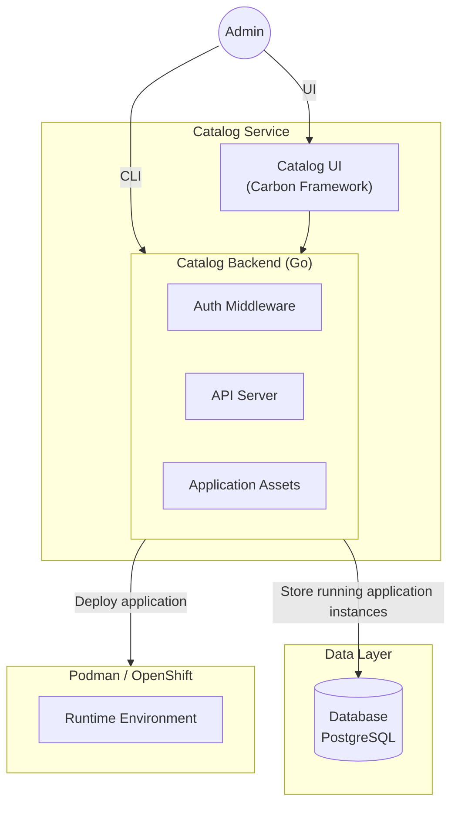
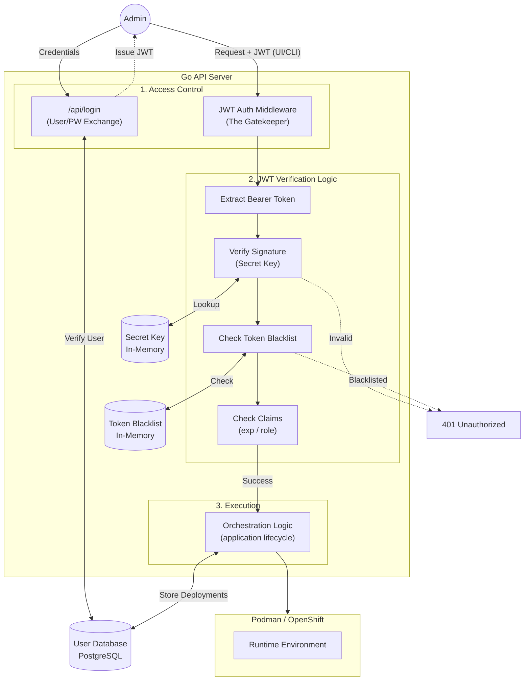

# Design Proposal: Catalog UI & Orchestration Service

**Subject:** Secure Enterprise Interface for IBM AI Services

**Target Platform:** RHEL LPAR (Standalone) / OpenShift (Clustered)

**Status:** Draft / Proposal

---

## 1. Executive Summary

The **Catalog UI Service** provides a centralized, authenticated web portal for managing the lifecycle of AI applications. By providing a high-fidelity interface, the service empowers users to discover application templates, **deploy AI services with one click**, and monitor real-time logs through a stable REST façade. This architecture eliminates the need for manual CLI interaction, providing a secure, single-origin experience for the enterprise.

## 2. Service Architecture

The architecture is centered on the **Catalog Service** as the management plane, with external data persistence and runtime orchestration capabilities.

* **Catalog UI (Carbon Framework)**: A frontend built with IBM's Carbon Design System, providing a professional and accessible interface for template browsing and app management.
* **Catalog Backend (Go)**: A compiled, high-concurrency backend containing:
  * **Auth Middleware**: JWT-based authentication and authorization layer
  * **API Server**: REST API endpoints for application lifecycle management
  * **Application Assets**: Embedded templates and configurations for AI services
* **Data Layer (External)**: PostgreSQL database for persistent storage of running application instances and deployment metadata.
* **AI Services Runtime**: The underlying infrastructure layer (Podman on LPAR or Kubernetes on OpenShift) that hosts deployed AI applications and services.



### 2.2 Database Schema

For detailed database design and schema specifications, see the [Database Design Proposal](https://github.com/IBM/project-ai-services/blob/main/docs/proposals/catalog/db-design-proposal.md).

## 3. Core Functional Capabilities

The Catalog UI transforms manual workflows into automated, repeatable processes:

* **Template Discovery**: A curated library of AI application templates, allowing users to browse pre-configured models and RAG (Retrieval-Augmented Generation) stacks.

* **Accelerated Deployment**: A "One-Click" deployment flow that automates container AI Services provisioning and service exposer.


* **Persistent State Management**: All deployment metadata, configurations, and user preferences are stored in the database for reliability and recovery.

## 4. Security Framework (JWT Authentication)

Security is managed at the Catalog UI Service level through a robust JWT-based authentication system with external database-backed user management.

* **Authentication:** The UI captures user credentials and exchanges them with the Go API Server for a signed JWT.
* **User Store:** User credentials are securely stored in an external PostgreSQL database with PBKDF2 hashed passwords.
* **JWT Middleware (The Gatekeeper):**
    1.  **Extraction:** Retrieves the Bearer token from the authorization header of every incoming request.
    2.  **Signature Verification:** The server utilizes an in-memory **Secret Key** to validate the token's integrity. If the signature does not match the payload, the request is immediately rejected.
    3.  **Claims Validation:** The middleware inspects expiration timestamps (`exp`) and RBAC roles (e.g., `admin` vs. `viewer` in future) before authorizing orchestration logic.
    4.  **Token Blacklisting:** Logout operations add tokens to an in-memory blacklist to prevent reuse. **Note:** For multi-instance deployments, this should be migrated to Redis for distributed token revocation.

> Note: Initially we will start with the admin role implementation and extend it to other roles in the future.



To ensure strict feature and security parity, both the **Catalog UI** and the **CLI** operate as standard clients to the Go API Server, adhering to identical authentication and orchestration protocols.

### CLI Login and Session Management

1. **Authentication:** Users authenticate via the CLI:
    ```bash
    $ ai-services login --username <user> --password <pass>
    ```
2. **Token Retrieval:** The CLI routes the request to the `/api/login` endpoint of the Go API Server.
3. **Secure Storage:** Upon success, the JWT is stored in a local configuration file (e.g., `~/.config/ai-services/config.json`) with restricted file permissions.
4. **Session Persistence:** Subsequent commands automatically inject this token into the `Authorization` header. If the token expires, the CLI prompts the user for a fresh login.

## 5. Service Bootstrapping

### Management Plane Initialization

For detailed instructions on installing and bootstrapping the Catalog Service, see the [Catalog Services Installation Proposal](https://github.com/IBM/project-ai-services/blob/main/docs/proposals/catalog/catalog-services-installation-proposal.md).

## 6. Artifacts
The Catalog Service is delivered as a set of portable, enterprise-grade artifacts designed to run identically across standalone RHEL hosts and clustered OpenShift environments.

### 6.1 Container Images

The solution is packaged into three primary container images. These are hosted in an enterprise registry (e.g., ICR) and pulled during the bootstrap phase.

| Image Alias | Image Name | Base OS / Tech Stack | Role |
| --- | --- | --- | --- |
| **API Server** | `catalog-api:v1` | Red Hat UBI 9 (Minimal) / Go | Orchestration, Auth, & Infrastructure Interfacing |
| **Catalog UI** | `catalog-ui:v1` | Red Hat UBI 9 (Nginx or Equivalent) / React | Carbon-based Web Portal & Asset Hosting |
| **Database** | `postgresql:18` | `icr.io/ppc64le-oss/postgresql-ppc64le` | Persistent data storage for users, deployments, and audit logs |

> **Note:** The PostgreSQL image is sourced from `icr.io/ppc64le-oss/postgresql-ppc64le`. Currently, version 16.3 is available, but it is recommended to use PostgreSQL 18+ for optimal performance and feature support.

### 6.2 Deployment Specifications

The `ai-services` CLI abstracts the underlying infrastructure by generating the necessary configuration manifests dynamically during the bootstrap process:

**OpenShift:** Orchestration requires the deployment of standard Kubernetes manifests, including:
- Deployments for pod management (API, UI, Database)
- Services for internal networking
- PersistentVolumeClaims for database storage
- Routes for external UI exposure
- Secrets for database credentials and JWT keys

**Podman:** Orchestration utilizes a simplified Pod deployment model, grouping the API, UI, and Database containers into pods on the RHEL host with:
- Volume mounts for database persistence
- Network configuration for inter-container communication
- Port mappings for external access

### 6.3 Database Configuration

**PostgreSQL:**
- Version: 18+
- Storage: Persistent volume (minimum 10GB)


## 7. API Endpoints

For detailed API specifications including authentication, application management, and catalog endpoints, see the [Application Deployment API Proposal](https://github.com/IBM/project-ai-services/blob/main/docs/proposals/catalog/application-deployment-api-proposal.md).

## 8. Future Enhancements

### 8.1 Role-Based Access Control (RBAC)
- Multiple user roles (admin, developer, viewer)
- Fine-grained permissions per deployment
- Team-based access management

### 8.2 Multi-Tenancy
- Namespace isolation per user/team
- Resource quotas and limits
- Cost tracking per tenant

### 8.3 Advanced Features
- Deployment templates and blueprints
- Scheduled deployments
- Automated scaling policies
- Integration with external monitoring systems
