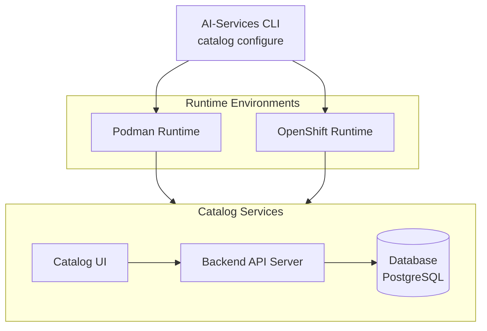

# AI-Services Catalog Services Installation Proposal

**Version:** 1.0  
**Date:** April 2026  
**Status:** Draft

---

## Executive Summary

This proposal outlines the design and implementation strategy for the AI-Services Catalog Services installation system. The catalog services comprise three core components: a user interface (UI), backend API server, and database layer. This document details the CLI-based installation approach, command structure, security considerations, and deployment architecture across multiple runtime environments.

---

## Table of Contents

1. [Overview](#overview)
2. [Architecture](#architecture)
3. [Installation Command](#installation-command)
4. [Catalog Management Commands](#catalog-management-commands)
5. [Security Considerations](#security-considerations)
6. [Asset Management](#asset-management)
7. [Conclusion](#conclusion)
8. [Appendix](#appendix)

---

## Overview

### Purpose

The AI-Services Catalog Services installation system aims to provide a unified, automated deployment mechanism for catalog infrastructure components. The system must support multiple runtime environments while maintaining consistent security practices and user experience.

### Scope

This proposal covers:

- **Bootstrap Installation**: Automated deployment of catalog services
- **CLI Interface**: Comprehensive command-line tools for catalog management
- **Multi-Runtime Support**: Deployment across Podman and OpenShift environments
- **Asset Management**: Binary storage and deployment of catalog manifests

### Goals

1. Simplify catalog services deployment across different runtime environments
3. Provide intuitive CLI commands for catalog lifecycle management
4. Enable seamless integration with existing AI-Services infrastructure
5. Support both root and rootless container execution modes

---

## Architecture

### Component Overview



### Technology Stack

- **CLI Framework**: Go-based command-line interface
- **Container Runtime**: Podman (root/rootless) or OpenShift
- **Backend**: RESTful API server with JWT authentication
- **Database**: PostgreSQL for metadata storage
- **Security**: PBKDF2 password hashing, JWT token management

---

## Installation Command

### Configure Command

The primary installation command initializes and deploys all catalog services with secure credential management.

#### Command Syntax

```bash
ai-services catalog configure [flags]
```

#### Flags

| Flag | Type | Required | Default | Description |
|------|------|----------|---------|-------------|
| `--runtime` / `-r` | string | Yes | - | Target runtime environment (podman, openshift) |
| `--params` | string[] | No | [] | Inline parameters to configure catalog service (comma-separated key=value pairs) |

#### Interactive Password Input

For enhanced security, the configure command prompts for the administrator password interactively rather than accepting it as a command-line flag. This approach:

- **Prevents password exposure** in shell history or process listings
- **Ensures secure input** through terminal masking
- **Follows security best practices** for credential management
- **Provides clear user feedback** during the setup process

When executed, the command will display a secure prompt:
```
Enter admin password: ********
```

The password is read securely from the terminal input and immediately processed for hashing, never being stored in plaintext in DB.

#### Available Parameters

The `--params` flag accepts the following configuration options:

- `ui.port`: Port for the catalog UI (default: random available port)
- `backend.port`: Port for the catalog backend API server (default: random available port)

Additional parameters can be added as needed for customization.

#### Installation Workflow

The bootstrap process executes the following steps:

1. **Runtime Validation**
   - Validate runtime type (must be 'podman' or 'openshift')
   - Initialize runtime factory based on specified runtime
   - Check platform support for Podman runtime
   - Verify runtime availability and compatibility

2. **Security Initialization**
   - Generate password hash using PBKDF2 cryptographic algorithm with:
     - Random salt generation (secure random bytes)
     - 100,000 iterations for enhanced security
     - SHA-256 hash function
     - Base64 encoding of salt and hash
   - Format: `iterations.salt.hash` (all base64 encoded)

3. **Podman URI Determination**
   - Check `CONTAINER_HOST` environment variable for remote connections
   - Determine user execution mode by checking user ID with sudo permission:
     - If user ID is 0 (root): Use root socket `/run/podman/podman.sock`
     - If user ID is non-zero (rootless): Use rootless socket `/run/user/$(id -u)/podman/podman.sock`
   - Automatically selects appropriate socket based on execution context

4. **Asset Deployment**
   - Load catalog templates from embedded assets (`assets/catalog`)
   - Select runtime-specific templates (podman/openshift)
   - Render templates with provided values and parameters
   - Deploy catalog pod containing:
     - Catalog UI container (port 3000)
     - Backend API server container (port 8080)
     - PostgreSQL database container
   - Configure networking and port mappings
   - Perform container creation and readiness checks

5. **Verification and Health Checks**
   - Wait for all containers to be created (timeout: 5 minutes)
   - Perform container readiness checks based on health check configuration
   - Validate service health and connectivity
   - Display next steps for accessing the catalog

6. **Printing Next Steps**
   - Output Catalog UI endpoint for user access
   - Display the web interface URL in format: `http://<host>:<ui-port>`

#### Example Usage

```bash
# Basic Podman deployment with default ports
ai-services catalog configure --runtime podman
# Prompts: Enter admin password: ********

# Podman deployment with custom UI port
ai-services catalog configure --runtime podman --params ui.port=3000
# Prompts: Enter admin password: ********

# OpenShift deployment (to be implemented)
ai-services catalog configure --runtime openshift
# Prompts: Enter admin password: ********
```

#### Implementation Notes

- **Current Status**: Implemented for Podman runtime only
- **OpenShift Support**: Planned for future implementation
- **Idempotency**: Command checks for existing catalog pods and skips deployment if already present
- **Template Execution**: Uses layered template execution similar to application deployment
- **Refactored Code**: Deployment flow refactored to be reusable between `app create` and `catalog configure`

---

## Catalog Management Commands

### API Server Command ✅ (Implemented)

Starts the catalog backend API server within the container environment.

#### Command Syntax

```bash
ai-services catalog api-server [flags]
```

#### Flags

| Flag | Type | Required | Default | Description |
|------|------|----------|---------|-------------|
| `--port` | int | No | 8080 | API server listening port |
| `--access-token-ttl` | duration | No | 15m | Access token time-to-live |
| `--refresh-token-ttl` | duration | No | 24h | Refresh token time-to-live |
| `--admin-username` | string | No | admin | Administrator username |
| `--admin-password-hash` | string | Yes | - | Hashed administrator password |

#### Implementation Notes

- Used internally during container startup
- Stores hashed password in database on initialization
- JWT secret key maintained in memory for security
- Supports token refresh mechanism for extended sessions

---

### Login Command ✅ (Implemented)

Authenticates users against the catalog API server.

#### Command Syntax

```bash
ai-services catalog login [flags]
```

#### Flags

| Flag | Type | Required | Default | Description |
|------|------|----------|---------|-------------|
| `--server` | string | No | http://localhost:8080 | Catalog API server URL |
| `--username` | string | No | - | Authentication username |
| `--password-stdin` | bool | No | false | Read password from stdin |

#### Behavior

- Prompts for credentials if not provided via flags
- Performs API authentication call to backend server
- Stores access token in user's home directory config file
- Supports secure password input via stdin

#### Example Usage

```bash
# Interactive login
ai-services catalog login --server http://catalog.example.com:8080

# Login with stdin password
echo "password" | ai-services catalog login \
  --server http://catalog.example.com:8080 \
  --username admin \
  --password-stdin
```

---

### Logout Command ✅ (Implemented)

Terminates the current catalog session.

#### Command Syntax

```bash
ai-services catalog logout [flags]
```

#### Flags

| Flag | Type | Required | Default | Description |
|------|------|----------|---------|-------------|
| `--server` | string | No | - | Catalog API server URL |

#### Behavior

- Removes authentication tokens from local config
- Deletes config file from home directory
- Supports server-specific logout for multi-server scenarios

---

### Whoami Command ✅ (Implemented)

Displays information about the currently authenticated user.

#### Command Syntax

```bash
ai-services catalog whoami [flags]
```

#### Flags

| Flag | Type | Required | Default | Description |
|------|------|----------|---------|-------------|
| `--server` | string | No | - | Catalog API server URL |

#### Output

Returns user information including:
- Username
- Authentication status
- Token expiration time
- Server URL

---

### Info Command

Displays information about the currently deployed catalog services, including the application name, version, and service endpoints.

#### Command Syntax

```bash
ai-services catalog info
```

#### Purpose

The info command provides essential deployment information for the catalog services, enabling users to quickly access service details and verify the deployment status.

#### Output Information

The command displays the following details about the currently deployed catalog:

**Application Information:**
- **Application Name**: The name of the deployed catalog application
- **Version**: Currently deployed catalog services version

**Service Endpoints:**
- **Catalog UI Endpoint**: Web interface URL for accessing the catalog
  - Format: `http://<host>:<ui-port>`
  - Example: `http://localhost:3000`
- **Catalog Backend API Endpoint**: REST API server URL for programmatic access
  - Format: `http://<host>:<backend-port>`
  - Example: `http://localhost:8080`

#### Example Output

```
Catalog Information
===================

Application Name: ai-services
Version: 1.0.0

Service Endpoints:
------------------
Catalog UI:      http://localhost:3000
Backend API:     http://localhost:8080
```

#### Use Cases

- **Endpoint Discovery**: Quickly obtain service URLs for accessing the catalog
- **Version Verification**: Check the currently deployed version
- **Integration Reference**: Get endpoint information for connecting applications
- **Deployment Validation**: Confirm successful catalog deployment

---

### Delete Command

Uninstalls and removes all catalog service components, including pods, containers, and associated resources from the runtime environment.

#### Command Syntax

```bash
ai-services catalog delete [flags]
```

#### Flags

| Flag | Type | Required | Default | Description |
|------|------|----------|---------|-------------|
| `--skip-cleanup` | bool | No | false | Skip cleaning up database data. When set, only removes containers and pods but preserves database data for future use. |

#### Purpose

The delete command provides a complete cleanup mechanism for catalog services, automatically removing all deployed resources and ensuring a clean uninstallation.

#### Deletion Process

The command automatically executes the following cleanup steps:

1. **Resource Identification**
   - Discovers all catalog-related pods
   - Identifies associated containers
   - Locates persistent volumes and configurations

2. **Graceful Shutdown**
   - Stops running containers gracefully
   - Allows in-flight requests to complete
   - Ensures data consistency before removal

3. **Complete Resource Removal**
   - Deletes all catalog pods
   - Removes all containers (UI, backend, database)
   - Cleans up network configurations
   - Removes persistent volumes (unless `--skip-cleanup` is set)
   - Deletes associated secrets and configurations

4. **Database Cleanup** (conditional)
   - If `--skip-cleanup` is **not** set (default behavior):
     - Removes all database data
     - Deletes persistent volumes containing database files
     - Ensures complete data removal
   - If `--skip-cleanup` **is** set:
     - Preserves database data and persistent volumes
     - Allows data to be reused in future deployments
     - Only removes running containers and pods

5. **Verification**
   - Confirms successful deletion of all resources
   - Reports cleanup summary
   - Validates complete removal (or partial removal if `--skip-cleanup` is used)

#### Example Usage

```bash
# Complete deletion (default - removes everything including database data)
ai-services catalog delete

# Output:
Deleting catalog services...
Stopping containers...
Removing pod ai-services--catalog...
Cleaning up database data...
Cleaning up resources...
Cleanup completed successfully.
All catalog resources have been removed.

# Deletion with database preservation
ai-services catalog delete --skip-cleanup

# Output:
Deleting catalog services...
Stopping containers...
Removing pod ai-services--catalog...
Skipping database cleanup (--skip-cleanup flag set)...
Cleaning up resources...
Cleanup completed successfully.
Catalog containers removed. Database data preserved.
```

#### Behavior

- **Automatic Cleanup**: Removes all catalog-related resources by default
- **Comprehensive Removal**: Ensures complete deletion of pods, containers, volumes, and configurations (unless `--skip-cleanup` is used)
- **Graceful Termination**: Allows services to shut down cleanly before removal
- **Idempotent Operation**: Safe to run multiple times; handles cases where resources are already deleted
- **Clear Feedback**: Provides detailed status messages throughout the deletion process
- **Selective Cleanup**: With `--skip-cleanup` flag, preserves database data while removing containers and pods

#### Use Cases

- **Clean Uninstallation**: Remove catalog services when no longer needed (default behavior)
- **Redeployment**: Clean environment before reinstalling with different configuration
- **Troubleshooting**: Remove problematic deployment for a fresh start
- **Environment Cleanup**: Free resources in development, testing, or production environments
- **Migration**: Clean up before moving to a different runtime or configuration
- **Data Preservation**: Use `--skip-cleanup` to preserve database data when:
  - Upgrading catalog services to a new version
  - Temporarily removing containers to free resources
  - Testing different configurations while keeping existing data
  - Migrating between container runtimes while preserving data

#### Important Notes

- **Permanent Operation**: By default, deletion is irreversible and removes all catalog data
- **Data Loss**: Without `--skip-cleanup`, all catalog configurations and stored data will be permanently deleted
- **Data Preservation**: With `--skip-cleanup`, database data is preserved for future use
- **Token Invalidation**: User authentication tokens will be invalidated after deletion
- **Backup Recommendation**: Backup any important data or configurations before deletion (unless using `--skip-cleanup`)
- **Complete Cleanup**: Ensures no orphaned resources remain in the runtime environment
- **Redeployment with Preserved Data**: When using `--skip-cleanup`, subsequent `catalog configure` commands can reuse the existing database data

---

## Security Considerations

### Password Management

1. **Hashing Algorithm**: PBKDF2 (Password-Based Key Derivation Function 2)
   - Industry-standard cryptographic algorithm
   - Resistant to brute-force attacks
   - Configurable iteration count for enhanced security

2. **Storage**: Hashed passwords stored in database (For now only Admin Password)
   - Never store plaintext passwords
   - Salt values unique per user
   - Regular security audits recommended

### Token Management

1. **JWT (JSON Web Tokens)**
   - Stateless authentication mechanism
   - Signed tokens prevent tampering
   - Configurable expiration times

2. **Token Types**
   - **Access Token**: Short-lived (15 minutes default)
   - **Refresh Token**: Long-lived (24 hours default)
   - Automatic token refresh for seamless user experience

3. **Secret Key Management**
   - Generated during catalog service backend deployment.
   - Stored in memory (not persisted to disk)

---

## Asset Management

### Asset Structure

Catalog manifest files are stored in binary format within the AI-Services CLI, organized by runtime:

```
assets/
├── catalog/
│   ├── metadata.yaml
│   ├── podman/
│   │   ├── metadata.yaml
│   │   ├── values.yaml
│   │   └── templates/
│   │       ├── catalog-ui.yaml.tmpl
│   │       ├── catalog-backend.yaml.tmpl
│   │       └── catalog-db.yaml.tmpl
│   └── openshift/
│       ├── Chart.yaml
│       ├── values.yaml
│       └── templates/
│           ├── catalog-ui-deployment.yaml
│           ├── catalog-backend-deployment.yaml
│           └── catalog-db-statefulset.yaml
```

### Template Processing

- Runtime-specific templates rendered with user-provided values
- Support for variable substitution and conditional logic
- Validation of generated manifests before deployment

**Current Implementation**: The catalog assets are currently available in the codebase at [ai-services/assets/catalog](https://github.com/IBM/project-ai-services/tree/main/ai-services/assets/catalog), which includes the Podman runtime templates and configuration.

---

## Conclusion

This proposal presents a comprehensive approach to implementing the AI-Services Catalog Services installation system. The design prioritizes security, flexibility, and ease of use while supporting multiple runtime environments.

---

## Appendix

### Glossary

- **PBKDF2**: Password-Based Key Derivation Function 2
- **JWT**: JSON Web Token
- **TTL**: Time To Live

---
