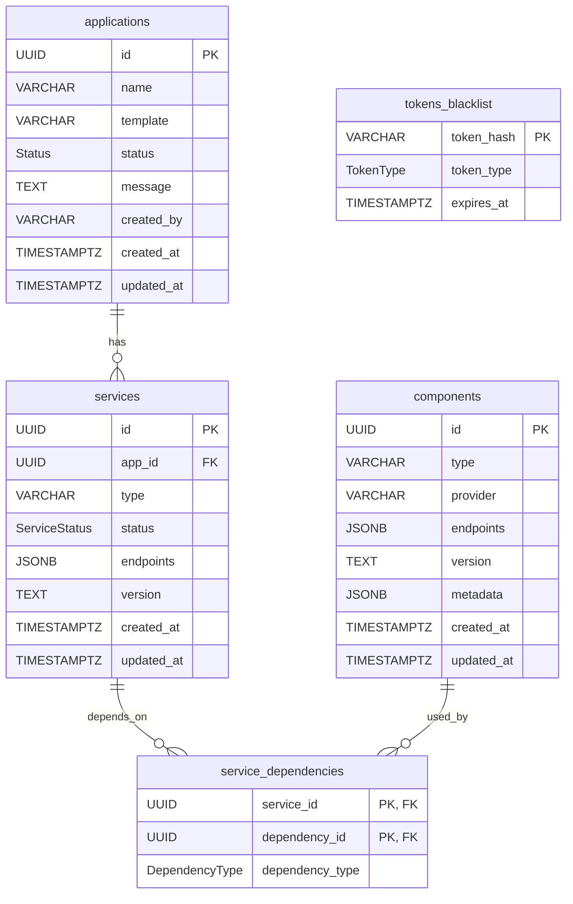

# Database Design Proposal for Catalog Service

## Overview

This document outlines the database design required for the Catalog service, including database selection rationale, schema design, and entity relationships.

## Table of Contents

1. [Database Selection](#database-selection)
2. [Database Schema](#database-schema)
3. [Table Definitions](#table-definitions)
   - [Applications Table](#1-applications-table)
   - [Services Table](#2-services-table)
   - [Components Table](#3-components-table)
   - [Service Dependencies Table](#4-service-dependencies-table)
   - [Tokens Blacklist Table](#5-tokens-blacklist-table)
4. [Entity Relationship Model](#entity-relationship-model)
5. [Relationships](#relationships)
6. [Key Design Decisions](#key-design-decisions)
7. [Migration Strategy](#migration-strategy)
8. [Common Queries](#common-queries)
9. [Future Considerations](#future-considerations)
10. [Security Considerations](#security-considerations)
11. [Conclusion](#conclusion)

## Database Selection

### Considerations

We evaluated the following database options:

- **PostgreSQL** - Relational Database
- **MongoDB** - NoSQL Document-based Database  
- **Redis** - In-memory cache (primarily for caching frequent data, can be used for persistence but not recommended as best practice)

### Decision: PostgreSQL

We have chosen **PostgreSQL** as our database for the following reasons:

1. **Relational Model Fit**: The Catalog service has clear relationships between Applications, Services, and Service Dependencies, which perfectly models the relational SQL structure with tables.

2. **Future Integration**: User management will be handled externally (e.g., via Keycloak as our Identity Provider and Identity Access Management tool). If we adopt Keycloak, we can reuse the same PostgreSQL instance for its data storage needs. This approach avoids maintaining multiple database instances.

3. **ACID Compliance**: PostgreSQL provides strong consistency guarantees essential for catalog management.

4. **Domain-Driven Design**: Services can have dependencies on other services, requiring a clear relationship model to track these dependencies.

## Database Schema

### Database Name

```
ai_services
```

## Table Definitions

### 1. Applications Table

**Table Name:** `applications`

| Column Name         | Data Type         | Constraints | Description |
|---------------------|-------------------|-------------|-------------|
| id                  | UUID              | PRIMARY KEY | Unique application identifier |
| name                | VARCHAR(100)      |             | Application name |
| template            | VARCHAR(100)      |             | Architecture/service template ID (e.g., rag, summarize, digitize) |
| status              | Status            | ENUM        | Current status (Downloading, Deploying, Running, Deleting, Error) |
| message             | TEXT              |             | Status message or error details |
| created_by          | VARCHAR(100)      |             | User who created the application |
| created_at          | TIMESTAMPTZ       | DEFAULT NOW() | Timestamp of creation |
| updated_at          | TIMESTAMPTZ       | DEFAULT NOW() | Timestamp of last update |

**Custom Types:**

```sql
CREATE TYPE status AS ENUM (
    'Downloading',
    'Deploying',
    'Running',
    'Deleting',
    'Error'
);
```

---

### 2. Services Table

**Table Name:** `services`

| Column Name         | Data Type         | Constraints | Description |
|---------------------|-------------------|-------------|-------------|
| id                  | UUID              | PRIMARY KEY | Unique service identifier |
| app_id              | UUID              | FOREIGN KEY | References applications(id) |
| type                | VARCHAR(100)      |             | Service type (e.g., Summarization, Digitization) |
| status              | ServiceStatus     | ENUM        | Current status (Running, Error) |
| endpoints           | JSONB             |             | Array of endpoint objects with name and endpoint fields: `[{"name": "ui", "endpoint": "http://..."}, {"name": "backend", "endpoint": "http://..."}]` |
| version             | TEXT              |             | Service version |
| created_at          | TIMESTAMPTZ       | DEFAULT NOW() | Timestamp of creation |
| updated_at          | TIMESTAMPTZ       | DEFAULT NOW() | Timestamp of last update |

**Custom Types:**

```sql
CREATE TYPE service_status AS ENUM (
    'Running',
    'Error'
);
```

---

### 3. Components Table

**Table Name:** `components`

This table stores reusable infrastructure components that can be shared across multiple services and applications. Components are standalone entities that don't belong to a specific application.

| Column Name         | Data Type         | Constraints | Description |
|---------------------|-------------------|-------------|-------------|
| id                  | UUID              | PRIMARY KEY | Unique component identifier |
| type                | VARCHAR(100)      |             | Component type (e.g., vector_store, llm, reranker, embedding) |
| provider            | VARCHAR(100)      |             | Provider/implementation (e.g., OpenSearch, vLLM) |
| endpoints           | JSONB             |             | Array of endpoint objects with name and endpoint fields: `[{"name": "internal", "endpoint": "http://..."}, {"name": "external", "endpoint": "http://..."}]` |
| version             | TEXT              |             | Component version |
| metadata            | JSONB             |             | Additional component-specific configuration and metadata. Example: `{"models": ["granite-7b-lab", "granite-3.0-8b-instruct"]}` |
| created_at          | TIMESTAMPTZ       | DEFAULT NOW() | Timestamp of creation |
| updated_at          | TIMESTAMPTZ       | DEFAULT NOW() | Timestamp of last update |

**Note:** Components do not have an `app_id` foreign key as they are shared resources that can be used by multiple services across different applications.

---

### 4. Service Dependencies Table (Taking it up at the end of Q2)

**Table Name:** `service_dependencies`

This table tracks dependencies between services and components, as well as between services themselves, enabling many-to-many relationships.

| Column Name         | Data Type         | Constraints | Description |
|---------------------|-------------------|-------------|-------------|
| service_id          | UUID              | PRIMARY KEY, FOREIGN KEY | References services(id) - The service that uses a component or another service |
| dependency_id       | UUID              | PRIMARY KEY, FOREIGN KEY | References either services(id) or components(id) - The service or component being used |
| dependency_type     | DependencyType    | ENUM, NOT NULL | Type of dependency: 'service' or 'component' |

**Composite Primary Key:** (service_id, dependency_id)

**Custom Types:**

```sql
CREATE TYPE dependency_type AS ENUM (
    'service',
    'component'
);
```

**Foreign Key Constraints:**
- service_id references services(id) ON DELETE CASCADE
- dependency_id can reference either services(id) or components(id) ON DELETE CASCADE

**Example Usage:**
```
Summarization Service → Vector Store Component (vector_store)
Chat Bot Service → LLM Component (llm)
Digitization Service → Vector Store Component (vector_store)
Summarization Service → Embedding Service (service-to-service)
```

---

### 5. Tokens Blacklist Table

**Table Name:** `tokens_blacklist`

This table manages blacklisted tokens for both access and refresh tokens. Tokens are stored as SHA-256 hashes for security and are added to the blacklist on logout or revocation.

| Column Name         | Data Type         | Constraints | Description |
|---------------------|-------------------|-------------|-------------|
| token_hash          | VARCHAR(64)       | PRIMARY KEY | SHA-256 hash of the JWT token (hex-encoded, 64 characters) |
| token_type          | TokenType         | ENUM, NOT NULL | Token type: "access" or "refresh" |
| expires_at          | TIMESTAMPTZ       | NOT NULL    | Token expiry timestamp |

**Custom Types:**

```sql
CREATE TYPE token_type AS ENUM (
    'access',
    'refresh'
);
```

**Indexes:**
- Primary key index on `token_hash` for fast lookup

**Security Note:**
- Tokens are hashed using SHA-256 before storage
- Only the hash is stored, not the actual token
- When checking a token, hash it first then query the database
- This prevents token extraction even if the database is compromised

---

## Entity Relationship Model



## Relationships

1. **Applications → Services**: One-to-Many
   - One application can have multiple services
   - Services reference their parent application via app_id
   - Services represent application-specific deployable units

2. **Services → Components**: Many-to-Many (via service_dependencies)
   - Services can depend on multiple components
   - Components can be shared across multiple services and applications
   - The service_dependencies table tracks which service uses which component
   - service_id: The service that requires/uses a component
   - dependency_id: The component or service being used/depended upon
   - dependency_type: Indicates whether the dependency is a 'component' or 'service'
   - Enables tracking of service-to-component and service-to-service relationships

3. **Services → Services**: Many-to-Many (via service_dependencies)
   - Services can depend on other services
   - The service_dependencies table tracks service-to-service dependencies
   - Supports scenarios like: a summarization service depending on an embedding service

4. **Components**: Independent shared resources
   - Components are standalone infrastructure entities (vector stores, LLMs, rerankers, embeddings)
   - No app_id foreign key - components are shared across applications
   - Include provider information (e.g., OpenSearch, vLLM)
   - Store metadata in JSONB format (e.g., list of models)
   - Can be used by multiple services simultaneously

5. **Tokens Blacklist**: Independent table
   - Stores revoked tokens for authentication middleware
   - Self-contained for security and performance
   - Tokens are automatically cleaned up after expiry

## Key Design Decisions

### 1. UUID Primary Key for Applications
The applications table uses UUID as the primary key:
- **Global Uniqueness**: Ensures unique identifiers across distributed systems
- **Security**: Non-sequential IDs prevent enumeration attacks
- **Immutable Identifier**: UUID remains constant throughout application lifecycle
- **Consistent with Services**: Aligns with services table design
- **Standard Practice**: Follows industry best practices for distributed systems

### 2. UUID Primary Keys for Services
Services table uses UUID as primary key for:
- Global uniqueness
- Better distribution in distributed systems
- Security (non-sequential IDs)

### 3. Custom Types
PostgreSQL custom types (ENUM) are used for:
- **status**: Standardizes application status values (Downloading, Deploying, Running, Deleting, Error)
- **service_status**: Standardizes service status values (Running, Error) - services only have operational states
- **dependency_type**: Standardizes dependency type values (service, component) - ensures type safety for service dependencies

### 4. Application Template Field
The template field in applications table stores:
- **Architecture/Service ID**: Stores the identifier of the architecture or service template (e.g., rag, summarize, digitize)
- **Direct Reference**: Template corresponds to the ID of the architecture/service being deployed
- **Simpler Schema**: Single template field replaces type and deployment_type columns
- **Clear Identification**: Template directly identifies which architecture or service is being deployed

### 5. Tokens Blacklist Table
The tokens_blacklist table provides token revocation management with enhanced security:
- **Database-backed**: Replaces in-memory implementation for multi-instance support
- **Token Hash Primary Key**: SHA-256 hash serves as the primary key for direct lookups
- **Hashed Storage**: Tokens stored as SHA-256 hashes (64-character hex strings)
- **Blacklist Approach**: Stores revoked tokens for both access and refresh token types
- **Token Type Enum**: Uses PostgreSQL ENUM type with values 'access' and 'refresh'
- **Automatic Expiry**: Tokens stored only until their natural expiry time
- **Minimal Design**: Only essential fields for token validation
- **Security**: Even if database is compromised, actual tokens cannot be extracted

### 6. Services and Components Separation
The schema separates application-specific services from shared infrastructure components:
- **Services Table**: Application-specific deployable units (e.g., Summarization, Digitization) with app_id foreign key
- **Components Table**: Shared infrastructure resources (e.g., vector_store, llm, reranker, embedding) without app_id
- **Clear Separation**: Services belong to applications, components are shared across applications
- **Flexible Design**: Easy to add new service and component types
- **Type-based Filtering**: Use type field to distinguish different types

### 7. Components Table Design
The components table stores shared infrastructure with specific design choices:
- **No app_id**: Components are shared resources not tied to specific applications
- **Provider Field**: Identifies the implementation (e.g., OpenSearch, vLLM)
- **Metadata JSONB**: Flexible storage for component-specific data (e.g., `{"models": ["granite-7b-lab", "granite-3.0-8b-instruct"]}`)
- **Endpoints Structure**: Uses internal/external naming convention for endpoint objects
- **Reusability**: Same component can be used by multiple services across different applications

### 8. Service Dependencies Table
The service_dependencies table provides explicit many-to-many relationship tracking:
- **Unified Dependencies**: Tracks both service-to-component and service-to-service relationships
- **Three Columns**: service_id, dependency_id, dependency_type
- **Composite Primary Key**: (service_id, dependency_id) ensures unique relationships
- **Cascade Deletes**: Automatically cleans up dependencies when services or components are deleted
- **Dependency Type**: Distinguishes between 'service' and 'component' dependencies
- **Flexible Queries**: Easy to find all dependencies for a service or all services using a component

### 9. UUID Consistency
- UUID used for all primary keys (applications, services, components)
- UUID used for all foreign key references (app_id, service_id, dependency_id)
- Provides global uniqueness and security across the system
- Consistent data type for identifiers throughout the schema

### 10. Timestamps
Applications, services, and components tables include `created_at` and `updated_at` with `TIMESTAMPTZ` for:
- Complete audit trail
- Time-zone aware timestamps
- Automatic timestamp generation and updates
- Tracking both creation and modification times
- Note: service_dependencies and tokens_blacklist tables intentionally exclude timestamps for minimal design

### 11. Immutable UUID Primary Key
The `id` field (UUID) serves as the primary key:
- Immutable to ensure consistent references across the system
- UUID provides stable, globally unique identifiers
- Prevents accidental ID collisions in distributed deployments
- Maintains referential integrity across all related tables

## Common Queries

### 1. Get all applications:
```sql
SELECT * FROM applications ORDER BY created_at DESC;
```

### 2. Get application with all services:
```sql
SELECT
    a.*,
    s.id as service_id,
    s.type as service_type,
    s.endpoints as service_endpoints,
    s.version as service_version
FROM applications a
LEFT JOIN services s ON a.id = s.app_id
WHERE a.id = 'application-uuid-here'
ORDER BY s.created_at;
```

### 3. Get all services for an application:
```sql
SELECT * FROM services
WHERE app_id = 'application-uuid-here'
ORDER BY created_at;
```

### 4. Get all components:
```sql
SELECT * FROM components ORDER BY created_at DESC;
```

### 5. Get components by type:
```sql
SELECT * FROM components WHERE type = 'vector_store' ORDER BY created_at DESC;
```

### 6. Get all dependencies (components and services) for a specific service:
```sql
SELECT
    scd.dependency_type,
    CASE
        WHEN scd.dependency_type = 'component' THEN c.type
        WHEN scd.dependency_type = 'service' THEN s.type
    END as dependency_type_name,
    CASE
        WHEN scd.dependency_type = 'component' THEN c.id
        WHEN scd.dependency_type = 'service' THEN s.id
    END as dependency_id
FROM service_dependencies scd
LEFT JOIN components c ON scd.dependency_id = c.id AND scd.dependency_type = 'component'
LEFT JOIN services s ON scd.dependency_id = s.id AND scd.dependency_type = 'service'
WHERE scd.service_id = 'service-uuid-here';
```

### 7. Get all services that depend on a specific component:
```sql
SELECT s.*
FROM services s
JOIN service_dependencies scd ON s.id = scd.service_id
WHERE scd.dependency_id = 'component-uuid-here'
  AND scd.dependency_type = 'component';
```

### 8. Get complete dependency graph for an application (services and components):
```sql
SELECT
    a.id as app_id,
    a.name,
    s.id as service_id,
    s.type as service_type,
    scd.dependency_type,
    CASE
        WHEN scd.dependency_type = 'component' THEN c.id
        WHEN scd.dependency_type = 'service' THEN dep_s.id
    END as dependency_id,
    CASE
        WHEN scd.dependency_type = 'component' THEN c.type
        WHEN scd.dependency_type = 'service' THEN dep_s.type
    END as dependency_type_name
FROM applications a
JOIN services s ON a.id = s.app_id
LEFT JOIN service_dependencies scd ON s.id = scd.service_id
LEFT JOIN components c ON scd.dependency_id = c.id AND scd.dependency_type = 'component'
LEFT JOIN services dep_s ON scd.dependency_id = dep_s.id AND scd.dependency_type = 'service'
WHERE a.id = 'application-uuid-here'
ORDER BY s.type, scd.dependency_type;
```

### 9. Find shared components (components used by multiple services):
```sql
SELECT
    c.id,
    c.type,
    c.provider,
    COUNT(DISTINCT scd.service_id) as service_count
FROM components c
JOIN service_dependencies scd ON c.id = scd.dependency_id
WHERE scd.dependency_type = 'component'
GROUP BY c.id, c.type, c.provider
HAVING COUNT(DISTINCT scd.service_id) > 1
ORDER BY service_count DESC;
```

### 10. Get application by id (direct lookup):
```sql
SELECT * FROM applications WHERE id = 'application-uuid-here';
```

### 11. Get applications by template:
```sql
SELECT * FROM applications WHERE template = 'rag';
```

### 12. Get all services by type:
```sql
SELECT * FROM services WHERE type = 'Summarization' ORDER BY created_at DESC;
```

### 13. Check if a service has any dependencies:
```sql
SELECT EXISTS(
    SELECT 1 FROM service_dependencies
    WHERE service_id = 'service-uuid-here'
) as has_dependencies;
```

### 14. Get component with its metadata (e.g., models):
```sql
SELECT
    id,
    type,
    provider,
    version,
    metadata->>'models' as models,
    endpoints
FROM components
WHERE id = 'component-uuid-here';
```

## Future Considerations

1. **User Management**: User authentication and authorization will be handled externally via Keycloak or similar identity management systems
2. **Audit Logging**: Consider adding `updated_by` columns to track who made changes
3. **Soft Deletes**: May add `deleted_at` column for soft delete functionality
4. **Indexing Strategy**: Create indexes based on query patterns as they emerge (e.g., on component type, provider, service type)
5. **Partitioning**: Consider table partitioning for large-scale deployments
6. **Dependency Validation**: Add application-level validation to prevent circular dependencies between services
7. **Component Versioning**: Track component version compatibility with dependent services
8. **Dependency Metadata**: Consider adding metadata to service_dependencies table (e.g., required vs optional, version constraints)
9. **Component Health Monitoring**: Add health status tracking for shared components
10. **Component Metadata Schema**: Define standard metadata schemas for different component types

## Conclusion

This database design provides a solid foundation for the Catalog service with:
- Clean and maintainable schema with 5 tables (applications, services, components, service_dependencies, tokens_blacklist)
- Clear separation between application-specific services and shared infrastructure components
- Services table for application-specific deployable units with app_id foreign key
- Components table for shared infrastructure resources (vector_store, llm, reranker, embedding) without app_id
- Explicit dependency tracking through service_dependencies junction table
- Support for both service-to-component and service-to-service relationships (many-to-many)
- Component provider field to identify implementations (e.g., OpenSearch, vLLM)
- Flexible JSONB metadata field for component-specific configuration (e.g., models list)
- User management handled externally (e.g., via Keycloak)
- Strong data integrity through foreign key constraints and ENUM types
- Efficient querying capabilities with proper indexing
- Flexibility to add new service and component types without schema changes
- Clear application-to-services relationship (one-to-many)
- Clear service-to-component and service-to-service dependency tracking (many-to-many)
- Enables tracking of shared components across multiple services and applications
- Tokens blacklist table for revoked access and refresh tokens
- Tokens stored as SHA-256 hashes for enhanced security
- Database-backed token management replacing in-memory implementation
- Minimal token blacklist design with only essential fields
